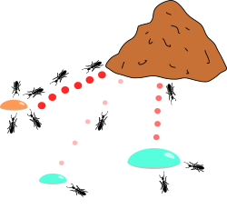

# ACO - Ant Colony Optimization

O ACO é uma **meta-heurística** para resolver problemas modelados com grafos (por exemplo: [TSP](https://en.wikipedia.org/wiki/Travelling_salesman_problem), [SPP](https://en.wikipedia.org/wiki/Shortest_path_problem), [AP](https://en.wikipedia.org/wiki/Assignment_problem), e entre outro que envolvem caminhos/combinações).


### Inspiração Biológia

Na natureza, formigas cegas encontram o caminho mais curto entre o formigueiro e a comida usando feromônios.

1. As formigas saem aleatoriamente.
2. Ao voltar com comida, elas deixam um rastro químico (feromônio).
3. Outras formigas têm maior probabilidade de seguir caminhos com mais feromônio.
4. O feromônio evapora com o tempo. Caminhos longos demoram mais para serem percorridos $\rightarrow$ o feromônio evapora antes de ser reforçado $\rightarrow$ o caminho fica fraco.
5. Caminhos curtos são percorridos mais vezes $\rightarrow$ acumulam mais feromônio $\rightarrow$ atraem mais formigas.



De forma análoga, no computador, as formigas são agentes artificiais que constroem soluções passo a passo, escolhendo o próximo nó com base em **feromônios** (memória global da busca) e **informações heurísticas** (visão local do problema, como distância ou custo). O **feromônio depositado** corresponde à **qualidade da solução encontrada** — caminhos melhores recebem mais reforço — e a **evaporação** representa a **redução gradual da importância de soluções antigas**, evitando que o algoritmo fique preso em opções ruins. Assim, tal como na natureza, surge um processo de **exploração guiada**, onde boas rotas são descobertas, reforçadas e, ao longo do tempo, convergem para caminhos próximos do ótimo.

### Definição formal

A probabilidade $P$ de uma formiga ir do node $i$ para o $j$ é:

$$P_{ij} = \frac{(\tau_{ij})^\alpha \cdot (\eta_{ij})^\beta}{\sum (\tau_{ik})^\alpha \cdot (\eta_{ik})^\beta}$$


##  Arquitetura

```
┌─────────────────┐
│  Mestre ACO     │  ← Coordena algoritmo, mantém feromônios
│  (Porta 50051)  │     Distribui trabalho, coleta soluções
└────────┬────────┘
         │
    ┌────┼────┬─────────┐
    │    │    │         │
┌───▼──┐ │  ┌─▼────┐  ┌─▼────┐
│Worker│ │  │Worker│  │Worker│
│  1   │ │  │  2   │  │  3   │
└──────┘ │  └──────┘  └──────┘
         │
    Executam formigas
    localmente em paralelo
```

### Componentes

1. **Mestre (aco_master.py)**
   - Mantém matriz de feromônios global
   - Coordena iterações do algoritmo
   - Distribui trabalho para workers
   - Recebe e processa soluções
   - Atualiza feromônios centralizadamente
   - Mantém melhor solução encontrada

2. **Workers (aco_worker.py)**
   - Solicitam trabalho ao mestre
   - Executam formigas localmente
   - Enviam soluções de volta ao mestre
   - Podem rodar em múltiplos terminais/máquinas

##  Como Executar

### 1. Instalação de Dependências

```bash
pip install -r requirements.txt
```

### 2. Gerar Código gRPC

**No Windows (PowerShell ou CMD):**
```bash
./generate_proto.bat
```

**No Linux/Mac ou Git Bash:**
```bash
chmod +x generate_proto.sh
./generate_proto.sh
```

**Ou manualmente:**
```bash
python -m grpc_tools.protoc -I. --python_out=. --grpc_python_out=. aco_distributed.proto
```

Isso irá gerar:
- `aco_distributed_pb2.py`
- `aco_distributed_pb2_grpc.py`

### 3. Executar o Sistema

#### **Terminal 1: Mestre**
```bash
python aco_master.py --port 50051 --iterations 10 --ants 5 --workers 2
```

Parâmetros:
- `--port`: Porta do servidor (padrão: 50051)
- `--iterations`: Número de iterações do ACO (padrão: 10)
- `--ants`: Formigas por worker por iteração (padrão: 5)
- `--workers`: Número de workers esperados (padrão: 2)

#### **Terminal 2: Worker 1**
```bash
python aco_worker.py --id 1 --master localhost:50051
```

#### **Terminal 3: Worker 2**
```bash
python aco_worker.py --id 2 --master localhost:50051
```

#### **Terminal 4: Worker 3 (opcional)**
```bash
python aco_worker.py --id 3 --master localhost:50051
```

Parâmetros:
- `--id`: ID único do worker (obrigatório)
- `--master`: Endereço do mestre (padrão: localhost:50051)

##  Exemplo de Execução

### Saída do Mestre:
```
======================================================================
  MESTRE ACO INICIADO
  Tamanho do grafo: 5 nós
  Iterações totais: 10
  Formigas por worker: 5
  Alpha: 1.0 | Beta: 3.0 | Rho: 0.5 | Q: 10
======================================================================

[Mestre] Aguardando 2 worker(s) para começar...

======================================================================
  ITERAÇÃO 1/10
  Melhor custo global: N/A
======================================================================

[Mestre] Worker 1 solicitou trabalho (Iteração 1/10)
[Mestre] Worker 2 solicitou trabalho (Iteração 1/10)
[Mestre] Worker 1 enviou solução | Iteração: 0 | Custo: 14.00
[Mestre] *** NOVA MELHOR SOLUÇÃO *** | Custo: 14.00 | Caminho: [0, 2, 3, 4, 1]
[Mestre] Worker 2 enviou solução | Iteração: 0 | Custo: 16.00
[Mestre] Todos os 2 workers completaram suas tarefas!

[Mestre] Atualizando feromônios com 2 soluções...
[Mestre] Feromônios atualizados!
```

### Saída do Worker:
```
============================================================
  WORKER 1 INICIADO
  Conectado ao mestre: localhost:50051
============================================================

[Worker 1] Iniciando execução...

============================================================
  WORKER 1 | ITERAÇÃO 1
  Executando 5 formiga(s)...
============================================================

[Worker 1] Formiga 1/5 | Custo: 16.00 | Caminho: [0, 1, 4, 3, 2]
[Worker 1] Formiga 2/5 | Custo: 14.00 | Caminho: [0, 2, 3, 4, 1]
[Worker 1] Formiga 3/5 | Custo: 15.00 | Caminho: [0, 2, 4, 3, 1]
[Worker 1] Formiga 4/5 | Custo: 14.00 | Caminho: [0, 2, 3, 4, 1]
[Worker 1] Formiga 5/5 | Custo: 16.00 | Caminho: [0, 1, 4, 2, 3]

[Worker 1] Melhor solução local: 14.00
[Worker 1] Enviando ao mestre...
[Worker 1] Solução aceita! Melhor custo global: 14.00
```

##  Estrutura de Arquivos

```
aco-algorithm/
├── aco.py                          # ACO original (não usado na versão distribuída)
├── graph.py                        # Classe Graph (não usado na versão distribuída)
├── main.py                         # Main original (não usado na versão distribuída)
│
├── aco_distributed.proto           # Definição do protocolo gRPC
├── aco_master.py                   # Servidor Mestre
├── aco_worker.py                   # Cliente Worker
│
├── generate_proto.bat              # Script Windows para gerar código gRPC
├── generate_proto.sh               # Script Linux/Mac para gerar código gRPC
├── requirements.txt                # Dependências Python
│
├── aco_distributed_pb2.py          # Gerado automaticamente
├── aco_distributed_pb2_grpc.py     # Gerado automaticamente
│
└── README_DISTRIBUIDO.md           # Este arquivo
```

##  Fluxo de Execução

### Para cada iteração:

1. **Workers solicitam trabalho** (`RequestWork`)
   - Enviam ID e timestamp ao mestre
   - Mestre responde com:
     - Número de formigas a executar
     - Matriz de feromônios atual
     - Matriz de distâncias
     - Parâmetros α e β

2. **Workers executam formigas localmente**
   - Cada worker executa N formigas
   - Formigas constroem soluções baseadas em feromônios
   - Worker encontra melhor solução local

3. **Workers enviam soluções** (`SubmitSolution`)
   - Enviam melhor caminho e custo ao mestre
   - Mestre responde com melhor solução global atual

4. **Mestre atualiza sistema**
   - Aguarda todos os workers enviarem soluções
   - Atualiza matriz de feromônios
   - Registra melhor solução encontrada
   - Avança para próxima iteração

5. **Finalização**
   - Após todas as iterações, mestre sinaliza término
   - Workers recebem flag `finished=True` e encerram

##  Protocolo gRPC

### Serviços

#### `ACOMasterService` (implementado pelo Mestre)

**RequestWork**
- Request: `WorkRequest { worker_id, timestamp }`
- Response: `WorkAssignment { num_ants, iteration, pheromone_matrix, distance_matrix, finished, alpha, beta }`

**SubmitSolution**
- Request: `Solution { worker_id, path, cost, iteration, timestamp }`
- Response: `SolutionResponse { accepted, current_best_cost, current_best_path, message }`

##  Parâmetros do ACO

- **α (alpha)**: Peso do feromônio (padrão: 1.0)
  - Maior valor = maior influência do feromônio

- **β (beta)**: Peso heurístico (padrão: 3.0)
  - Maior valor = maior preferência por distâncias curtas

- **ρ (rho)**: Taxa de evaporação (padrão: 0.5)
  - Valor entre 0 e 1
  - Maior valor = evaporação mais rápida

- **Q**: Quantidade de feromônio depositado (padrão: 10)
  - Soluções melhores depositam mais feromônio

##  Execução em Múltiplas Máquinas

Para executar em computadores diferentes:

1. **No servidor (Mestre):**
   ```bash
   python aco_master.py --port 50051 --iterations 20 --workers 3
   ```

2. **Nos clientes (Workers):**
   ```bash
   # Substitua <IP_DO_MESTRE> pelo IP do servidor
   python aco_worker.py --id 1 --master <IP_DO_MESTRE>:50051
   python aco_worker.py --id 2 --master <IP_DO_MESTRE>:50051
   python aco_worker.py --id 3 --master <IP_DO_MESTRE>:50051
   ```


## Autores
|  |  |  |  |
|:---:|:---:|:---:|:---:|
| [Thomas <br> Neuenschwander](https://github.com/thomneuenschwander) | [Thiago <br> Rezende](https://github.com/ThiagoRezendeAguiar) | [Luigi <br> Louback](https://github.com/LuigiLouback) | [Henrique <br> Lara](https://github.com/henriquerlara) |


|  |  |  |  |
|:---:|:---:|:---:|:---:|
| [Livia <br> Xavier](https://github.com/liviacx) | [Eduardo <br> Araújo](https://github.com/EduardoAVS) | [Tiago <br> Lascasas](https://github.com/Lasca101) | [Rodrigo <br> Drummond](https://github.com/DigoDrummond) |


## Fontes

- [YT - Otimização por Colônia de Formigas (ACO - Ant Colony Optimization)](https://www.youtube.com/watch?v=-uZmt_ErimY)

---


